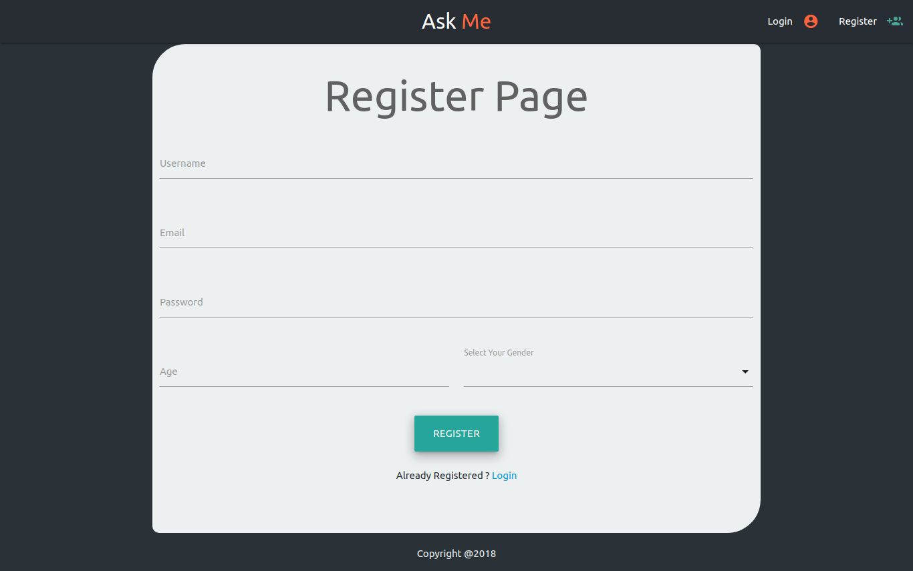
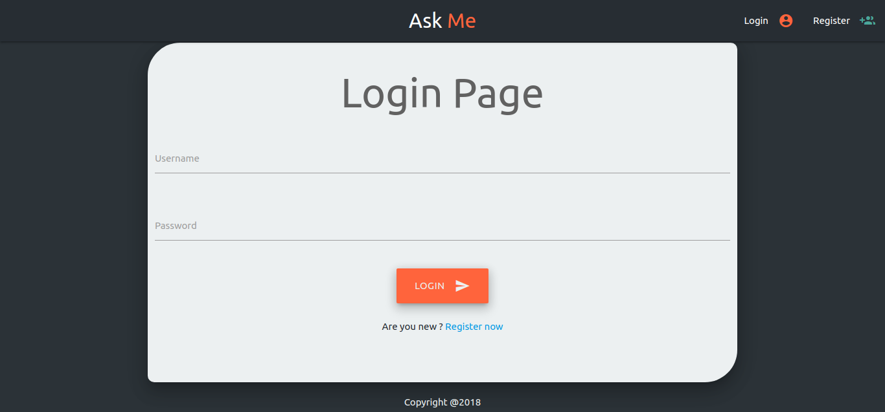
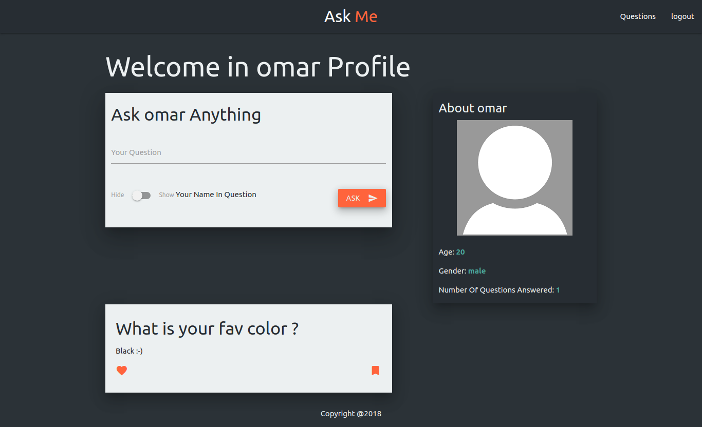
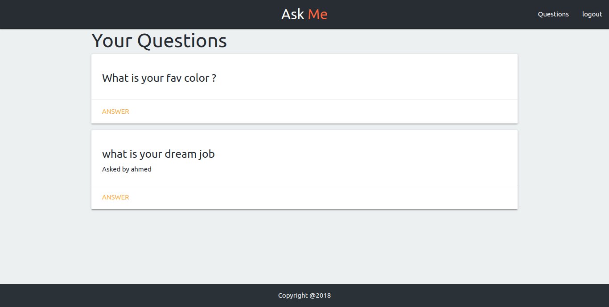
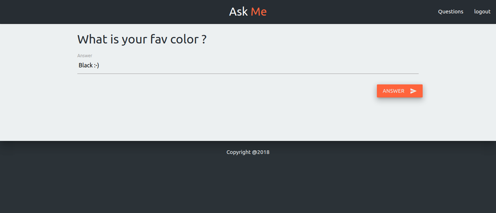

# Ask page
Website allow you to ask anyone (anonymously) or you can show your name, you can answer the questions which have been asked for you or delete it (it the same idea as ask.fm). 

Technology and languages Used: Materialize, JavaScript, Node.js, Express.js, MongoDB,.js, Passport.js

<a href="https://askmenowapp.herokuapp.com/"> Live preview try it out </a>

### 🚀 Demo

Mainpage


Register page


Login page


profile page


Questions page


Answering a question page


<h3>🚀 How to install and run the app</h3>

### installing dependices
which can be easily done using `npm` *if you installed node, npm will be installed*
```console
$ npm install
```

### runing the app
To `run` the app using `node`:
```console
$ node app.js
```
#### now open your browser and open `http://localhost:5000/`
